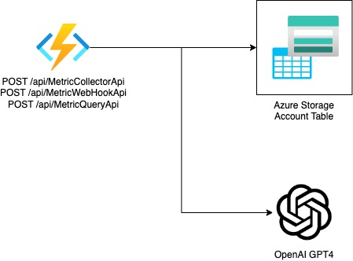

# DOMoS

DevOps Metrics of Success (DOMoS) is a set of APIs that aim to collect build (pipeline) and board (work items) data from Azure DevOps. 

The collected data can then be queried against using an OpenAI ChatGPT-like interface, where you can request to generate reports, leaderboards, tables or any other output type that relates to the stored data.   

## Architecture

### Component High Level Design
**Azure Functions** 

A Python-based Function App is used to process all metric requests and handle queries to Azure OpenAI services.

**Azure Table**

An Azure Table will be used to store Metrics that are collected by the Function App for use in queries.

**Azure OpenAI GPT4**

Azure OpenAI Service will be used to process a combination of a users' question and the underlying metrics.

## Development

To start developing the project the following dependencies will be required:

| Option | Windows | Linux | MacOS |
|--------|---------|-------|-------|
| Install Python 3.x | [Download](https://www.python.org/downloads/) | `sudo apt-get install python3` | [Download](https://www.python.org/downloads/) |
| Install Visual Studio Code | [Download](https://code.visualstudio.com/download) | [Download](https://code.visualstudio.com/download) | [Download](https://code.visualstudio.com/download) |
| Install Azure Functions Core Tools | `npm install -g azure-functions-core-tools@3 --unsafe-perm true` | `npm install -g azure-functions-core-tools@3 --unsafe-perm true` | `brew install azure-functions-core-tools@3` |

1. Update the /src/local.settings.json to include your project-specific settings (currently no mocked version of ADO)
2. Create local Python virtual environment 'python3.9 -m venv /src/.venv'
3. Start Azurite Docker Container 'docker compose up -f /docker/docker-compose.azurite.yml'
4. Test locally by running the command func start in your terminal from /src/

## Running Locally with Docker

### Build
'./buildscripts/01_build.sh'

| Environment Variable | Description |
| ------ | ----------- |
| `DOCKER_REGISTRY` | If set, overrides the docker registry. Defaults to 'local'. |
| `DOCKER_TAG` | If set, overrides the docker tag. Defaults to 'latest'. |

### Test
'./buildscripts/02_test.sh'

**TBC**

### Run
In order to keep your project secrets safe from distribution on GitHub, our Docker Compose requires a 'secrets.env' file to be present in the /docker/env/secrets/ directory. These secrets can be populated programmatically by using the parameters detailed in this section.

'./buildscripts/03_run.sh'

**If you are running for the first time use the following options to populate ** 
| Option | Description |
| ------ | ----------- |
| `--token <token>` | Personal access token for Azure DevOps (do not base64 encode) |
| `--organization <ORGANIZATION>` | Azure DevOps organization name |
| `--project <project>` | Azure DevOps project name |
| `--project-identifier <project-identifier>` | Azure DevOps project identifier used in regex to help get work item id from branch |
| `--azure-openai-key <azure-openai-key>` | Azure OpenAI API key |
| `--azure-openai-endpoint <azure-openai-endpoint>` | Azure OpenAI API endpoint |
| `--azure-openai-deployment-name <azure-openai-deployment-name>` | Azure OpenAI deployment name |
| `--help` | Display this help message |

### Build

'./buildscripts/04_distribute.sh'

| Environment Variable | Description |
| ------ | ----------- |
| `DOCKER_REGISTRY` | If set, overrides the docker registry. Defaults to 'local'. |
| `DOCKER_TAG` | Defaults to latest if a build is ran on the main branch. If not main the DOCKER_TAG will be the name of the branch. |